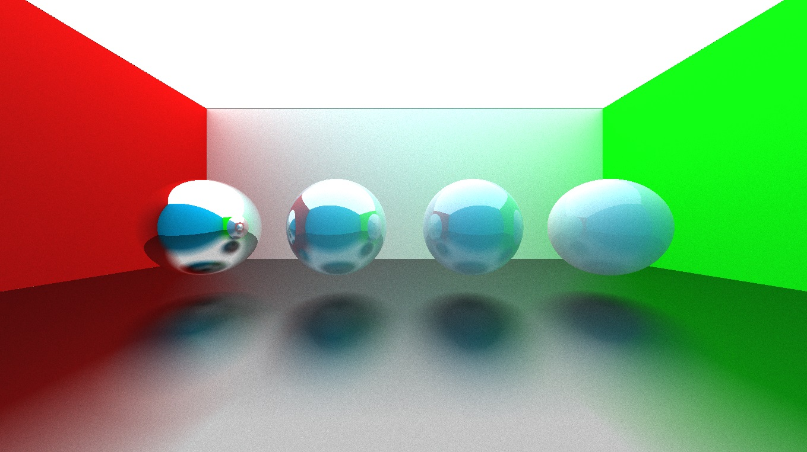

# Raytracer project in C++

## Goal

The goal of this project is to code a bidirectional path-tracer, that handles all sorts of objects including triangle meshes, and realistic shading, reflections, refraction and different kinds of materials. The secundary goal is to make it converge as fast as possible.

### State of the project

The project currently handles spheres, infinite planes and triangles, made up of materials of various reflectivity (from diffuse to glossy, to mirror), and specular probability (to simulate realistic reflections on non-metallic materials).

Current state:



Next steps:
Quads, cubes (boxes), texturing, refraction, variable reflectivity (at angle ~pi/2 of the normal, a diffuse plane becomes reflective), triangle and quad meshes (and parsing of models), bounding boxes (to accelerate the intersection computation), photon mapping (to accelerate the rendering of dark scenes).


## How to run the code

This C++ project requires the [SDL2 library](https://www.libsdl.org/). 

### Windows
To use SDL2 with MinGW on Windows, I downloaded the file ```SDL2-devel-2.28.5-mingw.zip``` from the [latest SDL2 release](https://github.com/libsdl-org/SDL/releases/tag/release-2.28.5), copied the folders ```include```, ```lib``` and the file ```bin/SDL2.dll``` in a folder ```sdl``` located at the root of the project.

To use the parallel render loop, I copied the ```parallel/parallel.h``` file from https://stackoverflow.com/a/49188371. Since the ```thread``` and ```mutex``` libraries were not recognized by my MinGW, I added the files ```mingw.thread.h```, ```mingw.mutex.h``` and ```mingw.invoke.h``` files from https://github.com/meganz/mingw-std-threads/tree/master in the ```include``` folder of my MinGW folder, and added the line ```#define _WIN32_WINNT 0x0501``` at the beginning of ```mingw.thread.h```.

To compile, I create a folder ```build``` at the root of the project and copy the ```SDL2.dll``` file (previously copied in ```sdl/bin```) into it. Then I use the following command lines (specify your own paths to gcc and g++). 
```
$ cmake .. -G "MinGW Makefiles" -DCMAKE_CXX_COMPILER=C:/MinGW/bin/g++.exe -DCMAKE_C_COMPILER=C:/MinGW/bin/gcc.exe -DCMAKE_MAKE_PROGRAM=make -DCMAKE_PREFIX_PATH=sdl  
$ make  
$ main.exe 5
```

### Linux
 
Install the SDL2 library, then create a folder ```build``` at the root, move to it and use the command lines:  
``````
$ cmake ..
$ make
$ .\main 5
``````

## Sources

[_Ray Tracing in One Weekend_](https://raytracing.github.io/books/RayTracingInOneWeekend.html)  
[_Scratchapixel_](https://www.scratchapixel.com)