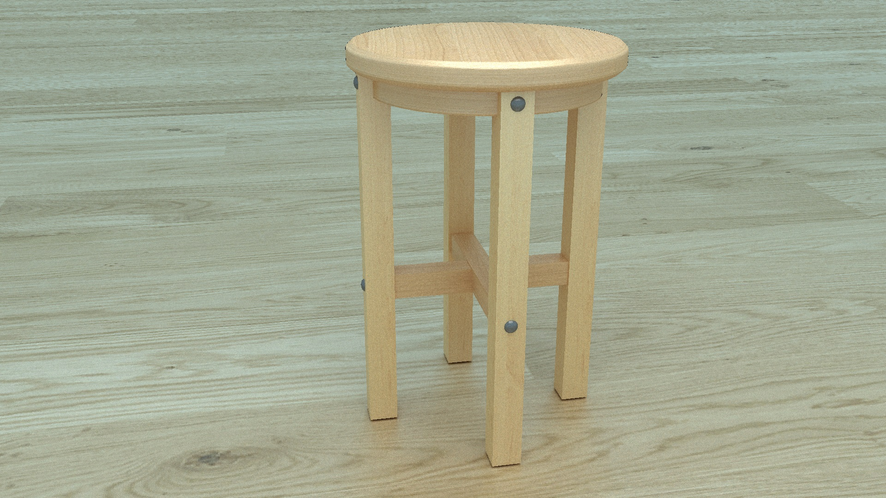

# Raytracer project in C++

## Goal

The goal of this project is to code a path-tracer that handles all sorts of objects, including polygon meshes, and realistic shading, reflections, refraction and different kinds of materials. The secondary goal is to make it converge as fast as possible.

### State of the project

The project currently handles polygon meshes (composed of triangles and quads for now) and multiple shapes (triangles, quads, spheres, planes, boxes and cylinders), made up of materials of various reflectivity (from diffuse to glossy, to mirror), specular probability (to simulate realistic reflections on non-metallic materials) and refractive index (for water, glass). Triangles and quads can be textured with textures read from bmp files, and objects can be imported from Wavefront .obj files. The rendering of polygon meshes is accelerated with the [Bounding Volume Hierarchy](https://en.wikipedia.org/wiki/Bounding_volume_hierarchy) method. Scenes are defined in a file ```scene.txt``` at the root (see the syntax in ```User-guide.md```). The rendered images can be exported as raw data (that can then be combined into a bmp) or as a bmp file. Raw data files can be merged into a bmp file, or can be postprocessed to add a glowing effect around bright lights (see ```User-guide.md```).

Current state:

 

Models found at [free3d.com](https://free3d.com/fr/3d-model/wood-stool-303532.html) and [CGTrader.com](https://www.cgtrader.com/free-3d-models/car/sport-car/2016-porsche-911-turbo).  

Next steps:  
Future plans involve the introduction of some bidirectionality to the path-tracing (to accelerate the rendering of dark scenes) and a conversion to GPU rendering.


## How to run the code

This C++ project requires the [SDL2 library](https://www.libsdl.org/). 

### Windows
To use SDL2 with MinGW on Windows, I downloaded the file ```SDL2-devel-2.28.5-mingw.zip``` from the [latest SDL2 release](https://github.com/libsdl-org/SDL/releases/tag/release-2.28.5), copied the folders ```include```, ```lib``` and the file ```bin/SDL2.dll``` in a folder ```sdl``` located at the root of the project.

To use the parallel render loop, I copied the ```include/parallel/parallel.h``` file from https://stackoverflow.com/a/49188371. Since the ```thread``` and ```mutex``` libraries were not recognized by my MinGW, I added the files ```mingw.thread.h```, ```mingw.mutex.h``` and ```mingw.invoke.h``` files from https://github.com/meganz/mingw-std-threads/tree/master in the ```include``` folder of my MinGW folder, and added the line ```#define _WIN32_WINNT 0x0501``` at the beginning of ```mingw.thread.h```.

To compile, I create a folder ```build``` at the root of the project and copy the ```SDL2.dll``` file (previously copied in ```sdl/bin```) into it. Then I use the following command lines (specify your own paths to gcc and g++). 
```
$ cmake .. -G "MinGW Makefiles" -DCMAKE_CXX_COMPILER=C:/MinGW/bin/g++.exe -DCMAKE_C_COMPILER=C:/MinGW/bin/gcc.exe -DCMAKE_MAKE_PROGRAM=make -DCMAKE_PREFIX_PATH=sdl  
$ make  
$ main.exe 5
```

### Linux
 
Install the SDL2 library, then create a folder ```build``` at the root, move to it and use the command lines:  
``````
$ cmake ..
$ make
$ .\main 5
``````

See command-line arguments and scene descriptor syntax in ``User-guide.md``.  

## Sources

[_Ray Tracing in One Weekend_](https://raytracing.github.io/books/RayTracingInOneWeekend.html)  
[_Scratchapixel_](https://www.scratchapixel.com)