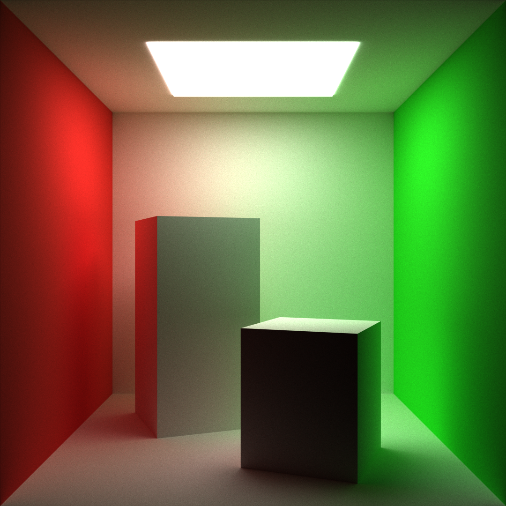
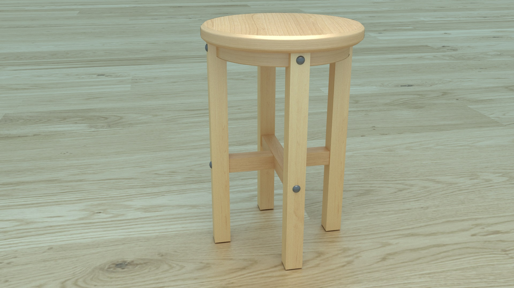
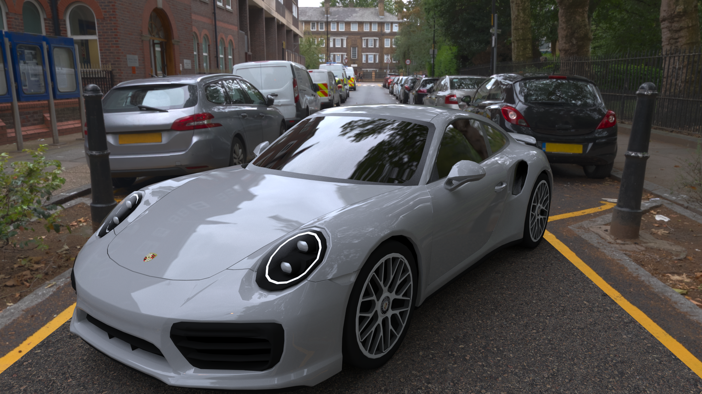
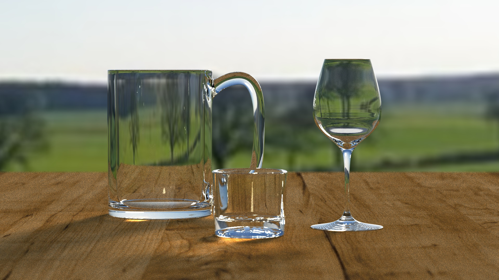
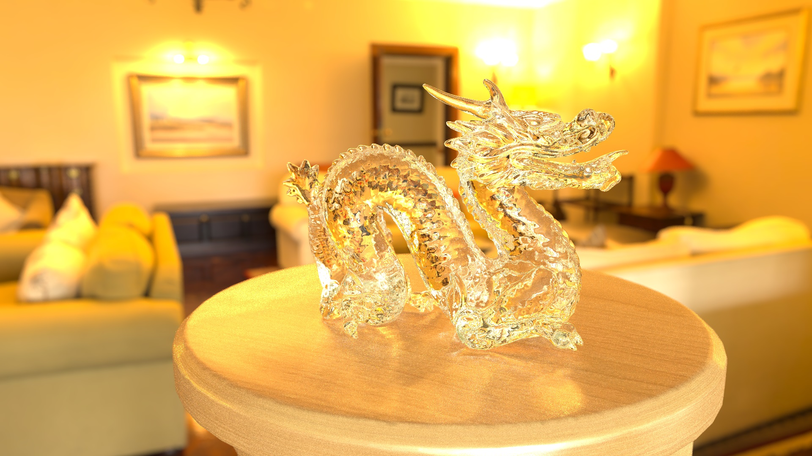

# Renders

## Cornell

Recreation of the famous Cornell box scene, 10000 samples per pixel. It was made with pure BSDF sampling, without light sampling.

## Stool

This was the first render of a textured 3D model I did. Due to its simplicity, I think it looks good. The ground texture looks pixelated though.

## Porsche street

This render is an attempt at reproducing [this video](https://youtu.be/Hcq7Eq0SLl8?si=DwdFc53QtwvtGFhI). It is a better version of the [previous render](obsolete/porsche_street.jpg), that now features Fresnel effect and more natural reflections. The ratio of lights bouncing on the windshield is adjusted to make it look like a double glazing, like real cars.

## Glasses

This is an improvement over a previous attempt (in ``obsolete``) that did not feature the spherical background. This one takes forever to converge, since there is only one small light source, that is rarely hit with BSDF sampling. Light sampling will improve convergence speed. Caustics look wrong, but the only techniques to properly get them are photon mapping and bidirectional path-tracing.

## Stanford dragon

The dragon model features 870'000 triangles, which is the largest object I rendered. Since it is made of glass, each sample is very long to compute, which is why it still looks very grainy.

