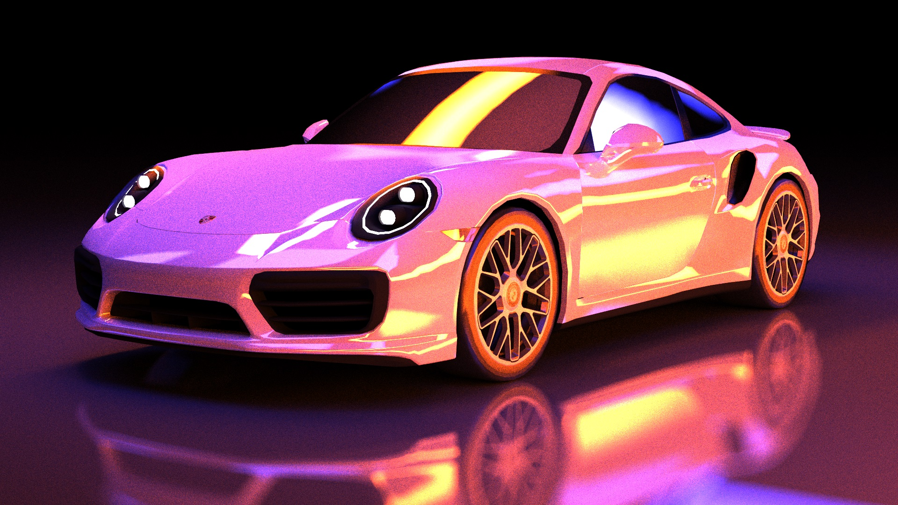
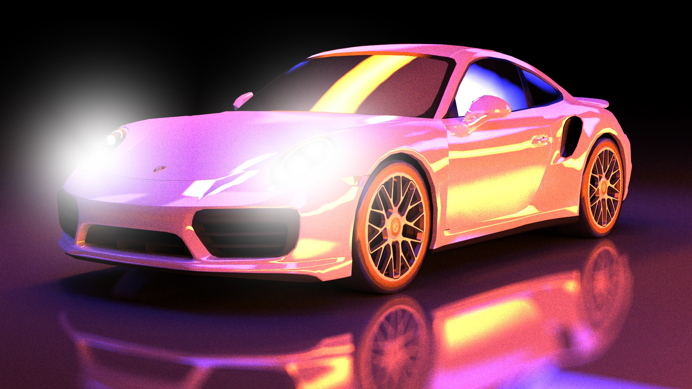
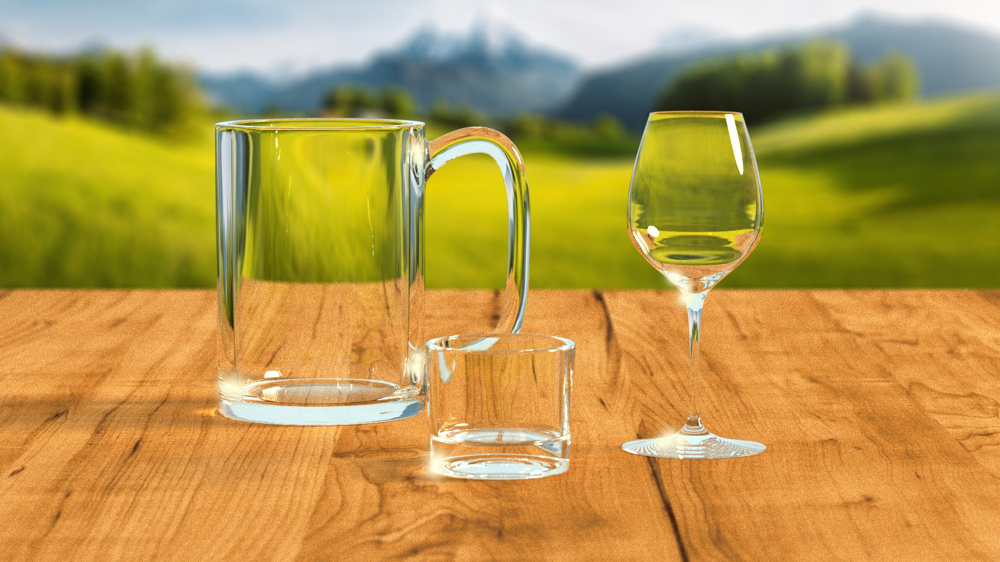
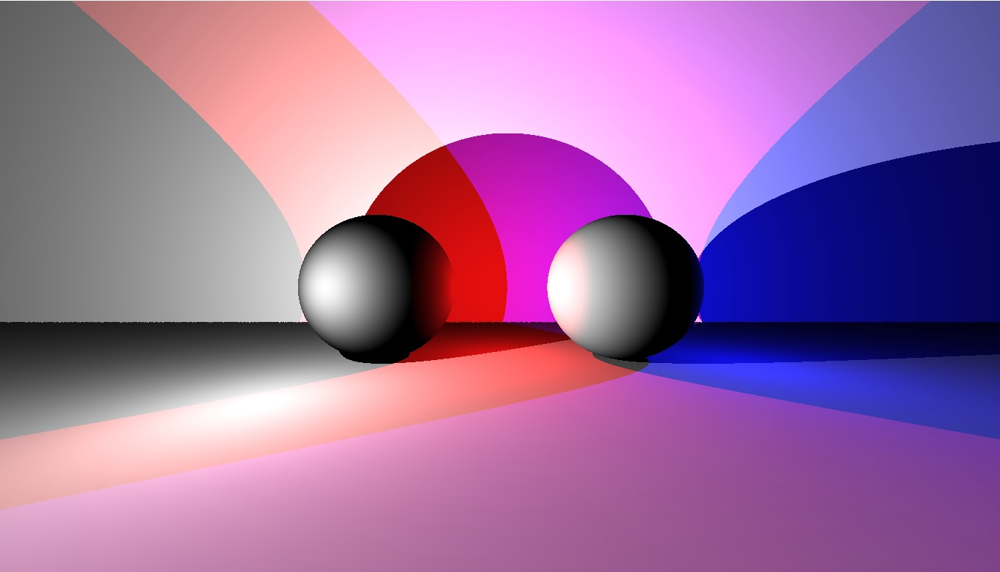

# Obsolete pictures

## Porsche neon   
An experimentation with the Porsche model and neon lights. It does not feature the Fresnel effect on the reflective surfaces, and the grain is very noticeable. I will attempt a similar render in the future.  
The second render is a quick attempt at doing a bloom effect through postprocessing. Physically-based bloom through Fourier transform is next up on the to do list.

 

## Glasses   
This render was made before the spherical background was implemented. It is just a flat texture on a wall, which is noticeable in the wine glass refraction on the right. This render features a bit of glow effect, which in retrospect seems out of place.   
For comparison, the render with textured background looks much better. However, due to lack of light sampling, this one takes forever to render and still looks grainy after 3000 samples per pixel (hidden a bit by the depth of field).

 

## Legacy   
A render made with the raytracer in the state it was in 2014 when I first did it as a student project. It was not a path-tracer, as it only computed the first intersection and then sampled the (point) light sources. It was not a Monte-Carlo algorithm either, it only computed the render after one sample per pixel.

